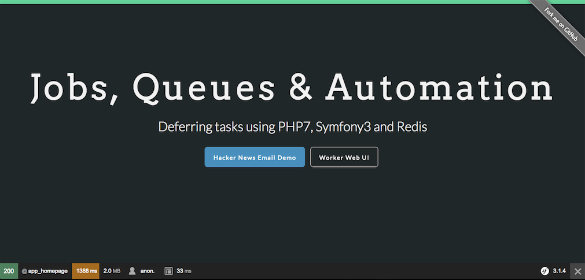

### Required software
- [virtualbox](https://www.virtualbox.org/wiki/Downloads)
- [vagrant](https://www.vagrantup.com/downloads.html)
- [homebrew](http://brew.sh/)
- ansible `brew install ansible`


### Clone and provision
```
git clone git@github.com:sameg14/symfony-jobs-queues-automation.git
cd symfony-jobs-queues-automation
vagrant up
```

### Add a hosts entry
Add the following line to `/etc/hosts`
```
10.10.10.123    jobdemo.vm
```

### Run demo
[http://jobdemo.vm](http://jobdemo.vm)